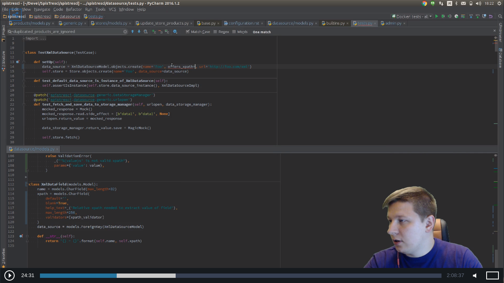

SpisTresci
==============================
.. image:: https://img.shields.io/github/license/mashape/apistatus.svg?maxAge=2592000?style=plastic   :target: https://github.com/SpisTresci/SpisTresci

.. image:: https://travis-ci.org/SpisTresci/SpisTresci.svg?branch=master
     :target: https://travis-ci.org/SpisTresci/SpisTresci?branch=master
     :alt: Build Status

.. image:: https://readthedocs.org/projects/spistresci/badge/?version=latest
     :target: http://spistresci.readthedocs.io/en/latest/?badge=latest
     :alt: Documentation Status

.. image:: https://badges.gitter.im/Join Chat.svg
   :target: https://gitter.im/SpisTresci/SpisTresci?utm_source=badge&utm_medium=badge&utm_campaign=pr-badge&utm_content=badge

SpisTresci is metasearch engine perfect for building price comparison websites. 

In near future project will be **renamed and splitted** into two repositories: 

- Scrooge (or Scrooger?) - generic price comparison engine
- SpisTresci.pl - website dedicated for Polish market, build on Scrooge[r] engine, focused on ebooks, audiobooks and books

Documentation
-------------

Documentation is available at http://spistresci.readthedocs.io/. Moreover each instance once deployed, has own documentation available at http://docs.<host_url>/

Live Streaming
--------------

This project is developing during live-coding sessions at https://www.livecoding.tv/noisy/, on:

* Mondays, 7 PM - 11 PM (EST)
* Wednesday, 7 PM - 11 PM (EST)
* Fridays, 7 PM - 11 PM (EST)
* Saturdays, when I will get up :)

Recordings are available: https://www.livecoding.tv/noisy/videos/

LICENCE
-------

SpisTresci is licensed under the MIT License.
