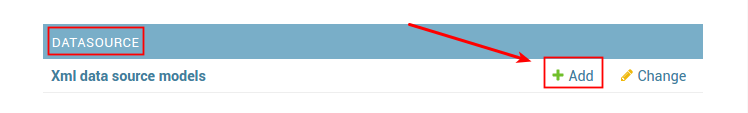
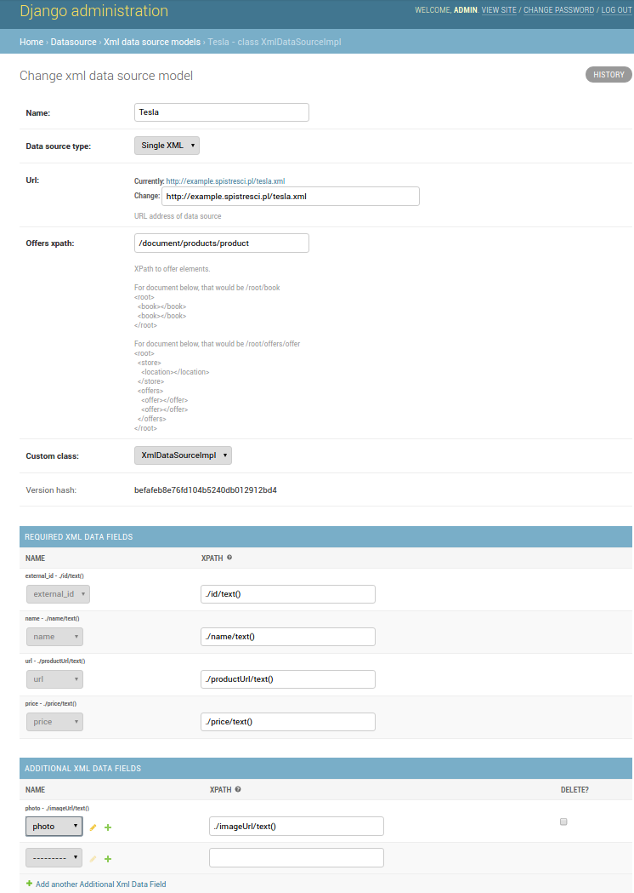

Configuration
=============

Adding new Store
----------------

Before you will be able to add new store, you have to first configure DataSource which will be responsible for providing information how to get data about latest offers from this store.

Defining new DataSource
-----------------------

Right now matadata about products/offers can be imported from XML files. However architecture of SpisTresci supports multiple formats of input data. If you need a support for different format of API, please `create an Issue on our github`_. You can also provide a support for new formats on your own by providing custom classes which will be derived from `DataSourceModel`_ and `DataSourceImpl`_ classes.

.. _create an Issue on our github: https://github.com/SpisTresci/SpisTresci/issues/new
.. _DataSourceModel: ../../spistresci/datasource/models.py
.. _DataSourceImpl: ../../spistresci/datasource/generic.py

To create DataSource for new Store, go to admin panel and click "+Add" next to DataSource of desired type.

**Properties:**

Name
  Each type of DataSource should have own unique name. All other properties are specific for different types of DataSources. Please read documentation for specific DataSource type for more details.

XMLDataSource
-------------

Data Source type
    XMLDataSource is capable of extracting data not only from single XML file, but also from archives which contains multiple XML files. With *Data Source type* you can specify behaviour for file downloaded from specified *url*.

    Single XML
        The most basic case, when *Store* expose all products by single XML file as API

Url
    Address from which data will fetched periodically

Offers root xpath
    XPath to element which children are offers elements.

    For document below, that would be ``/root/book``

    .. code-block:: html

        <root>
            <book></book>
            <book></book>
        </root>

    and in that case, that would be ``/root/offers/offer``

    .. code-block:: html

        <root>
            <store>
                <location></location>
            </store>
            <offers>
                <offer></offer>
                <offer></offer>
            </offers>
        </root>

Custom Class
    Sometimes data provided by Store do not suit very well to assumptions which need to be made during design of database. For example, we assumed that each product has unique integer *id* in *Store* database, or each product has name no longer than 256 characters. For sure there are Stores, which can have products with even longer names, or Stores which have alphanumeric ids.

    In such cases, there is no other choice than write some additional code, which will handle those specific cases in desired way. You can find examples of such classes written in Python in `spistresci/datasource/specific`_ directory. Your new custom class should derived from *DataSourceImpl* (directly or indirectly).

.. _spistresci/datasource/specific: ../../spistresci/datasource/specific/

XMLDataFields
-------------

Required XML Data Fields
    .. image:: images/datasource_required_xmldatafields.png

    Right now there are exactly four required *XML Data Fields* - *external_id*, *name*, *price*, *url*. That means that you have to provide information (by xpath), how to extract those product metadata.
    If *Store* which you want to add do not have any of *Required XML Data Fields*, there is no other way - you have to write your own *Custom Class* to hadle such weird case.

    external_id
        is an *id* of product which *Store* uses in own database to identify specific product (name of product is not the best candidate for being a unique identifier, because there can be multiple products with the same name).
    name (default='')
        Because products have to be presented somehow to users, that is why we need something like *name* for each product.

        If xpath will not be properly resolved, default value will be used.

    price (default=Decimal('0.00'))
        Each product should have own price. If xpath will not be properly resolved, default value will be used.
        
        If xpath will not be properly resolved, default value will be used.

    url (default='')
        We assume, that each product has own url, where you can find details about it.
        
        If xpath will not be properly resolved, default value will be used.

Additional XML Data Fields
    .. image:: images/datasource_additional_xmldatafields.png

    The great news is that you can store any data about offers/products in the database! :) The only thing which you have to do to is provide the *name* for the property and information how to extract value of this property from XML document (by *xpath*)

    For example, to store information about *size* of product in your database, just create new field with name *size* (or 'dimensions' if you prefer - name of property do not have to be exactly the same as it is in XML document of specific store). You will be able to fetch all additional data stored in database via API.

XMLDataFields - XPath
---------------------

XPath (`XML Path Language`_) is a best way to specify how to exctract data from XML document. Let's take a look on few examples. Having fallowing XML Document:

.. _XML Path Language: https://en.wikipedia.org/wiki/XPath
.. code-block:: html

    <document>
      <company>
        <ceo>Elon Musk</ceo>
        <employees>13058</employees>
        <address>
          <city>Palo Alto</city>
          <state>California</state>
          <country>USA</country>
        </address>
      </company>
      <products>
        <product avail="0">
          <id>1</id>
          <model>Tesla Roadster</model>
          <imageUrl>https://www.teslamotors.com/sites/default/files/styles/blog-picture_2x_1400xvar_/public/0H8E6227_1.jpg</imageUrl>
        </product>
        <product avail="1">
          <id>2</id>
          <model>Tesla Model S</model>
          <price>63400.00</price>
          <productUrl>https://www.teslamotors.com/models</productUrl>
          <imageUrl>https://www.teslamotors.com/tesla_theme/assets/img/models/section-initial.jpg</imageUrl>
        </product>
        <product avail="1">
          <id>3</id>
          <model>Tesla Model X</model>
          <price>69300.00</price>
          <productUrl>https://www.teslamotors.com/modelx</productUrl>
          <imageUrl>https://www.teslamotors.com/tesla_theme/assets/img/modelx/section-exterior-profile.jpg</imageUrl>
        </product>
        <product avail="1">
          <id>4</id>
          <model>Tesla Model 3</model>
          <price>35000.00</price>
          <productUrl>https://www.teslamotors.com/model3</productUrl>
          <imageUrl>https://www.teslamotors.com/sites/default/files/images/model-3/gallery/gallery-1.jpg</imageUrl>
        </product>
      </products>
    </document>

with xpath ``/document/products/product/model`` you will get ``['Tesla Roadster', 'Tesla Model S', 'Tesla Model X', 'Tesla Model 3']``, and similarly with ``/document/products/product/price`` you will get ``['63400.00', '69300.00', '35000.00']`` (please notice that we got only 3 prices, because 'Tesla Roadster' is not available and document do not describe it's price).

Because of the structure of typical XML document like this, part ``/document/products/product`` may seem to be redundant. Actually, it is very important, because without it alghorithm would not know how to group extracted properties into properties of single offer.

To overcome this problem in that case ``/document/products/product`` should be specified as *offers root xpath* for whole XMLDataSource.

Thanks to that, all *XML Data Field*'s xpaths can be simplified and replaced **with relative xpaths**. In that case that would be: ``./model``, ``./price``.

Example of complete configuration
---------------------------------

